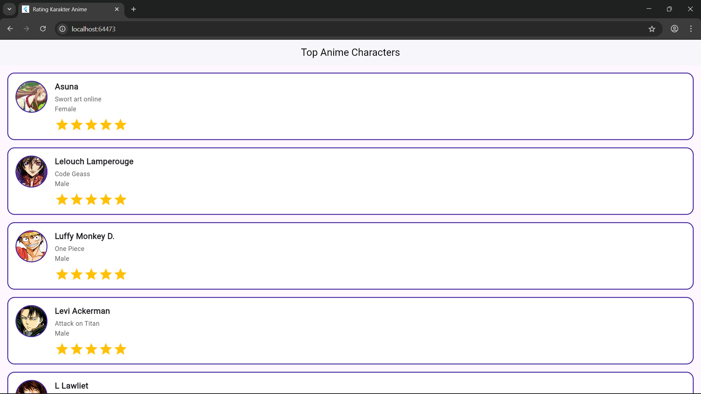

🌟 Rating Karakter Anime - Flutter App

Aplikasi sederhana berbasis Flutter untuk menampilkan daftar karakter anime favorit beserta sistem rating bintang yang interaktif. Proyek ini dibuat sebagai purwarupa (prototype) untuk mempelajari dasar-dasar desain antarmuka (UI/UX) di Flutter dan penggunaan *State Management* dasar.

✨ Fitur Utama

- Daftar Dinamis (Scrollable List): Menampilkan banyak data karakter tanpa membebani memori perangkat menggunakan `ListView.builder`.
- Gambar Lokal (Local Assets): Menampilkan foto karakter yang diambil langsung dari penyimpanan lokal aplikasi (bukan dari internet).
- Rating Interaktif: Pengguna dapat memberikan rating 1 hingga 5 bintang dengan mengklik ikon bintang. Tampilan akan langsung diperbarui menggunakan `setState`.
- Reusable Component: Desain kartu karakter dipisah ke dalam *class* `CharacterCard` khusus agar kode lebih rapi dan mudah digunakan ulang.

Tampilan Aplikasi

